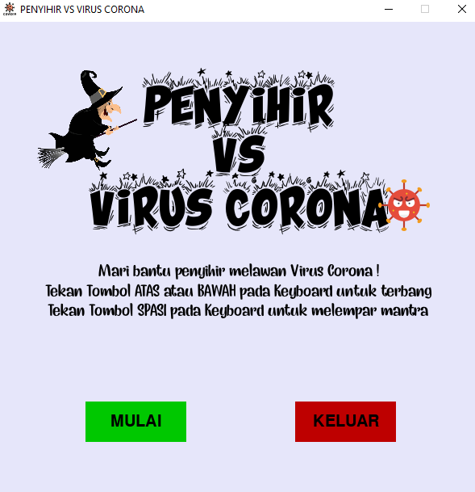
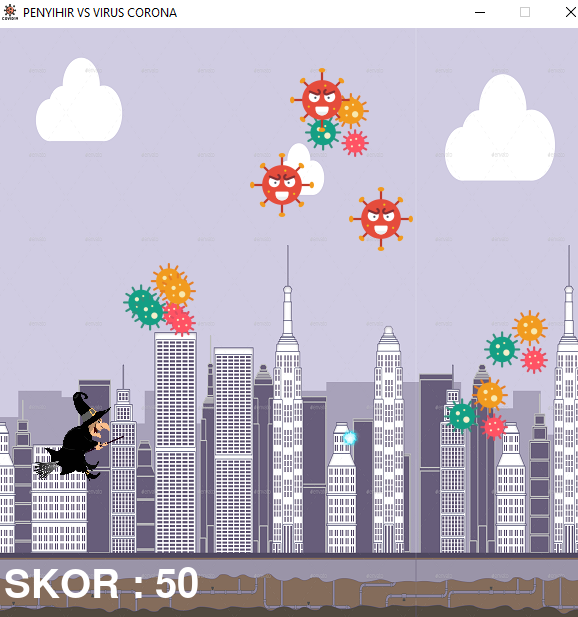
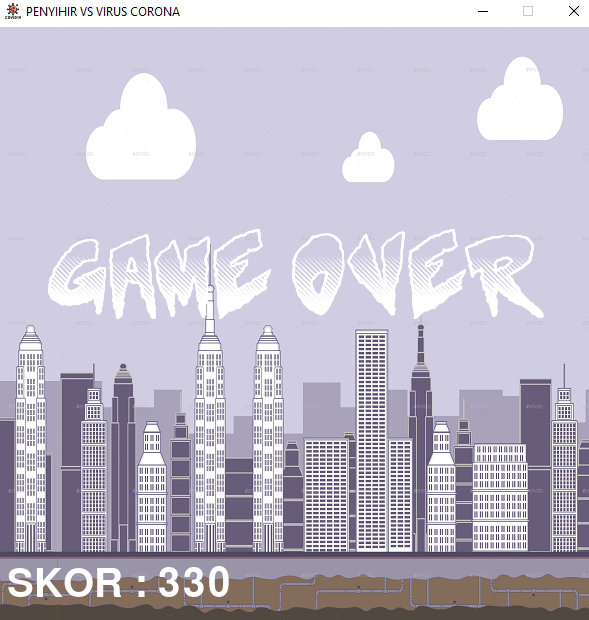

# Game "Penyihir vs Corona"

## Deskripsi

Game "Penyihir vs Corona" adalah sebuah game fantasi sederhana yang dikembangkan menggunakan bahasa pemrograman Python dengan memanfaatkan library pygame. Dalam game ini, pemain akan mengendalikan seorang penyihir yang ditantang oleh corona beserta pasukannya untuk mengalahkan mereka.

## Cara Bermain

1. Tekan tombol "Mulai" untuk memulai permainan.
2. Tekan tombol "Spasi" pada keyboard untuk menembak mantra.
3. Gunakan tombol keyboard "Atas" untuk terbang lebih tinggi dan "Bawah" untuk terbang lebih rendah.
4. Permainan akan berakhir jika corona berhasil menyentuh atau melewati penyihir.

## Tujuan

Tujuan dari permainan ini adalah untuk membunuh sebanyak mungkin virus corona dan mendapatkan sebanyak mungkin poin. Semakin tinggi poin yang diperoleh, semakin baik kinerja pemain dalam menghadapi pandemi wkwk...

## Karakter

- **Penyihir**:
  - Deskripsi: Penyihir yang bertugas melawan corona dan pasukan corona.
  - Kemampuan: Bisa terbang (hanya bisa bergerak vertikal), menembak mantra, dan memukul mundur virus corona.

- **Corona**:
  - Deskripsi: Suka senyum dan berwarna merah.
  - Kemampuan: Bergerak secara horizontal, dapat berkembang biak.

- **Pasukan Corona**:
  - Deskripsi: Terdiri dari 3 anggota tim, hijau, merah, dan kuning. Mereka bergerombol dan berusaha mendekati penyihir.
  - Kemampuan: Bergerak vertikal dan horizontal, dapat berkembang biak, dan bergerak cepat.

## Cara Memulai Game

Untuk memulai game ini, pastikan Anda telah menginstal Python dan library pygame di komputer Anda. Kemudian, jalankan berkas `main.py` dengan menggunakan Python interpreter. Game akan terbuka dan Anda dapat mulai bermain.

## Tangkapan Layar

## Pesan Penting

Game ini bertujuan untuk memberikan hiburan semata ya teman-teman...

Selamat bermain dan tetap sehat! Kontribusi dipersilahkan :) Jika anda memiliki feedback terkait projek ini ataupun projek saya yang lain, silahkan [klik disini](https://forms.gle/9wCLAopVYYbjpsB87). Terima kasih.

